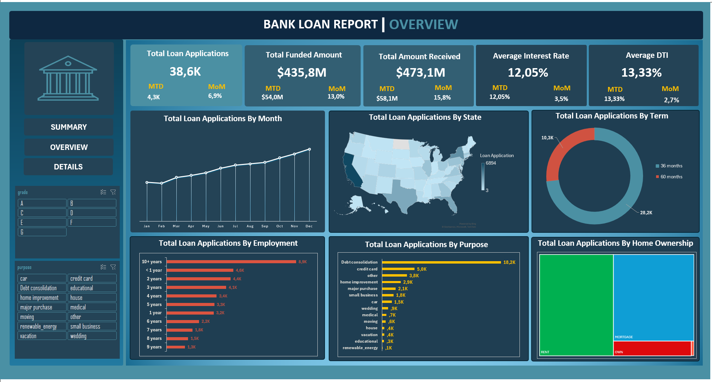

# 📊 Loan Analysis Dashboard (Excel)

This is an Excel-based interactive dashboard created to analyze and visualize bank loan data. It highlights trends in loan applications, funding, and borrower behavior. The project demonstrates key Excel skills such as Power Query, pivot tables, charts, and data storytelling.

---

## 🔍 Dashboard Overview

The dashboard provides insights into:

- Total loan applications and funding
- Good vs. bad loan performance
- Interest rates and debt-to-income (DTI) ratios
- Loan purpose, term, and employment trends
- Geographic and ownership breakdowns

---

## 🔑 Key Findings

- **86% of loans** were categorized as good loans, indicating low risk.
- **Debt consolidation** was the most common loan purpose (18.2K applications).
- The majority of borrowers preferred **60-month terms** over 36-month options.
- Applicants with **10+ years of employment** represented the largest group.
- Higher **interest rates and DTI** were associated with bad loans.

---

## 📁 Project Files

| File / Folder               | Description                                   |
|----------------------------|-----------------------------------------------|
| `loan-anlysis-dashboard.xlsx` | Excel workbook with the interactive dashboard |
| `assets/`                  | Folder containing dashboard screenshots        |

---

## 🖼️ Dashboard Snapshots

### Overview Page

### Loan Details Page

---

## 🛠 Tools Used

- Microsoft Excel
- Power Query
- Pivot Tables & Charts
- Data Cleaning
- Conditional Formatting
- Visual Dashboard Design

